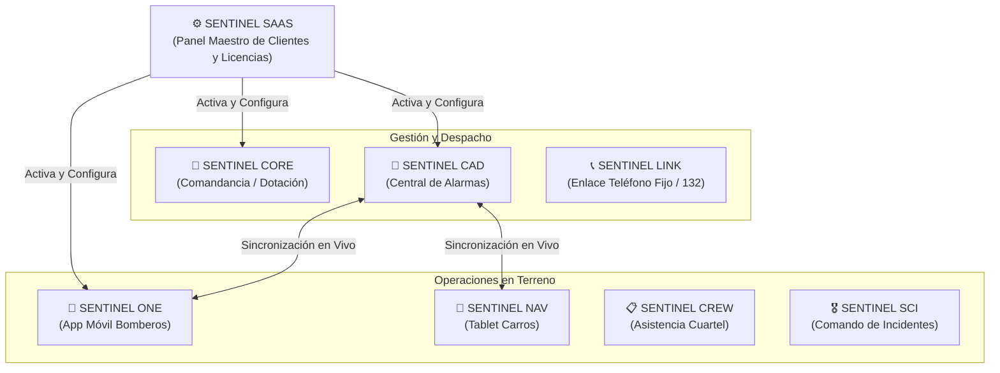
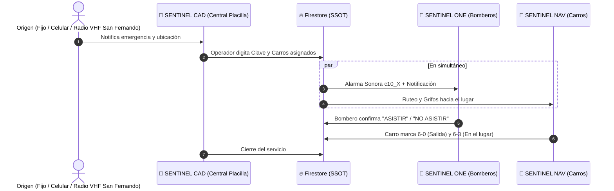

# 🛡️ SENTINEL — Sistema Canónico de Gobernanza y Arquitectura

> **Documento Oficial de Reglas, Arquitectura y Esquema Canónico (SSOT)**  
> **Versión:** 1.1.0 | **Despliegue Multi-Cuerpo (SaaS)**

---

## 🌳 1. Módulos de la Suite SENTINEL

---

## ⚡ 2. Flujo Simple de un Despacho

---

## 📋 3. Diccionario Canónico (Campos Clave)

### `despachos`
* `idServicio`: String (ID único del llamado).
* `clave`: String (`10-0-1`, `10-30`, `10-2`).
* `lugar`: String (Dirección o sector).
* `preinforme`: String (**Siempre minúscula**).
* `carros`: String (`B-1, BX-1`).
* `horaDespacho`: String (`HH:mm:ss`).
* `fechaDespacho`: String (`dd/MM/yyyy`).
* `operadorFinal`: String (Vacío `""` = Activo | Con texto = Cerrado).
* `unidades`: Map con estado (`6-0`, `6-3`), chofer y OBAC de cada carro.

### `personal`
* `idRegistro`: String (Ficha del bombero).
* `nombreBombero`: String (Nombre oficial).
* `idRadial`: String (`1`, `101`, `C1`).
* `estado`: String (`0-9`, `0-8`, `CDS`, `LICENCIA`, `SUSPENDIDO`).
* `enServicio`: String (`"0"` = Libre | `"{id}"` = Asiste | `"-{id}"` = No asiste).
* `activo`: Boolean (`true` / `false`).
* `cargo`: String (`"COMANDANTE"`, `"VOLUNTARIO"`, `"BOMBERO HONORARIO"`).

### `organizaciones` (SaaS Multi-Tenant)
* `idOrganizacion`: String (Ej: `"cb_placilla"`).
* `nombre`: String (`"Cuerpo de Bomberos de Placilla"`).
* `licenciaActiva`: Boolean.
* `tipoRecepcionAlarma`: String (`"RADIO_VHF"`, `"FIJO_LOCAL"`, `"132"`).
* `telefonoCentral`: String.
